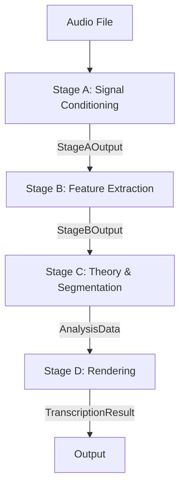

# Pipeline Workflow & Contracts

This document outlines the detailed call graph, data flow, algorithms, and configuration triggers for the music transcription pipeline (Stages A-D).

## High-Level Data Flow



## Algorithm Selection Logic

The pipeline dynamically selects algorithms and processing paths based on the input audio texture (Mono/Poly) and configuration overrides.

```mermaid
flowchart TD
    Start([Stage A: Detect Audio Type]) --> CheckType{Audio Type?}

    CheckType -- Monophonic --> MonoPath[Processing Mode: Mono]
    CheckType -- Polyphonic --> PolyPath[Processing Mode: Poly]

    subgraph StageB [Stage B: Feature Extraction]
        MonoPath --> DetectorSelect{Instrument?}
        PolyPath --> SepCheck{Separation Enabled?}

        SepCheck -- Yes --> RunDemucs[Run HTDemucs / SyntheticMDX]
        SepCheck -- No --> ProcessMix[Process Mix Only]

        RunDemucs --> MultiStem[Multi-Stem Processing]
        ProcessMix --> SingleStem[Single Stem Processing]

        MultiStem --> Detectors
        SingleStem --> Detectors

        Detectors --> Ensemble[Ensemble Merge]
        Ensemble --> PeelingCheck{Poly Context + Max Layers > 0?}

        PeelingCheck -- Yes --> ISS[Iterative Spectral Subtraction]
        PeelingCheck -- No --> OutputB[Stage B Output]
        ISS --> OutputB
    end

    subgraph StageC [Stage C: Segmentation]
        OutputB --> PolyFilter{Filter Mode?}

        PolyFilter -- "skyline_top_voice" --> Skyline[Skyline Selection\n(Confidence + Vocal Bias)]
        PolyFilter -- "decomposed_melody" --> DecompMelody[Decompose + Pick Best Track]
        PolyFilter -- "process_all" --> DecompAll[Decompose All Tracks]

        Skyline --> SegMethod{Segmentation Method}
        DecompMelody --> SegMethod
        DecompAll --> SegMethod

        SegMethod -- "hmm" --> Viterbi[HMM / Viterbi Path]
        SegMethod -- "threshold" --> Gate[RMS/Confidence Gate]

        Viterbi --> OutputC[Analysis Data]
        Gate --> OutputC
    end
```

## Stage A: Load & Preprocess (`backend/pipeline/stage_a.py`)

**Goal:** Normalize audio into a consistent, analysis-ready format (Mono, Fixed Sample Rate, Normalized Gain) and perform initial global analysis (BPM, Texture).

### Strategies & Algorithms

1.  **Loading & Resampling**:
    *   **Algorithm**: `librosa.load` (with fallback to `scipy.io.wavfile`).
    *   **Why**: Detectors (especially Neural ones) require fixed sample rates (default 44100Hz, or 22050Hz for optimization).
2.  **Mono Conversion**:
    *   **Algorithm**: Average channels `(L+R)/2` or select specific channel.
    *   **Why**: Pitch detection is inherently monophonic in the time domain; source separation handles spatial information later if needed.
3.  **DC Offset Removal**:
    *   **Algorithm**: `y = y - mean(y)`.
    *   **Why**: Removes 0Hz energy that biases RMS calculations and zero-crossing rates.
4.  **High-Pass Filter (HPF)**:
    *   **Algorithm**: Butterworth filter (default order 4, ~55-60Hz).
    *   **Why**: Removes sub-bass rumble and mic handling noise that confuses fundamental frequency (f0) estimators.
5.  **Peak Limiting (Optional)**:
    *   **Algorithm**: Tanh soft-clipping or hard clipping.
    *   **Why**: Tames transients (snare hits, piano attacks) to prevent clipping during normalization.
6.  **Loudness Normalization**:
    *   **Algorithm**: EBU R128 (via `pyloudnorm`) or RMS-based gain.
    *   **Why**: Ensures consistent energy levels for detector confidence thresholds (e.g., "silence" is consistently < -50dB).
7.  **BPM Detection**:
    *   **Algorithm**: `librosa.beat.beat_track` (tightness=100).
    *   **Why**: Provides the rhythmic grid for quantization in Stage D.
8.  **Texture Detection**:
    *   **Algorithm**: Spectral flatness analysis (`detect_audio_type`).
    *   **Why**: Sets `AudioType` (Mono/Poly) to guide Stage B/C algorithm selection.

### Configuration & Thresholds

| Parameter | Default | Range | Description |
| :--- | :--- | :--- | :--- |
| `target_sample_rate` | 44100 | 16k-48k | Working sample rate. |
| `loudness_normalization.target_lufs` | -23.0 | -30 to -14 | Target integrated loudness. |
| `high_pass_filter.cutoff_hz` | 55.0 | 20-100 | HPF cutoff frequency. |
| `silence_trimming.top_db` | 50 | 20-80 | Threshold below peak to consider silence. |
| `bpm_detection.min_bpm` | 55.0 | 30-200 | Minimum allowed tempo. |
| `bpm_detection.max_bpm` | 215.0 | 60-300 | Maximum allowed tempo. |

### Output Contract: `StageAOutput`

```python
@dataclass
class StageAOutput:
    stems: Dict[str, Stem]      # "mix" stem always present
    meta: MetaData              # SR, Duration, BPM, Key, AudioType
    audio_type: AudioType       # MONOPHONIC | POLYPHONIC | POLYPHONIC_DOMINANT
    noise_floor_rms: float      # Estimated noise floor
    beats: List[float]          # Detected beat timestamps (seconds)
    diagnostics: Dict[str, Any] # "bpm_method", "preprocessing_applied", etc.
```

---

## Stage B: Feature Extraction (`backend/pipeline/stage_b.py`)

**Goal:** Extract fundamental frequency (f0) contours, confidence scores, and perform source separation if necessary.

### Strategies & Algorithms

1.  **Instrument Profile Resolution**:
    *   **Strategy**: Resolves `InstrumentProfile` (e.g., "piano_61key") to override detector params (fmin/fmax, thresholds).
2.  **Source Separation (Optional)**:
    *   **Trigger**: `config.stage_b.separation.enabled` (True/Auto) AND AudioType is Polyphonic.
    *   **Algorithm**: `HTDemucs` (Hybrid Transformer Demucs) or `SyntheticMDX` (lightweight fallback).
    *   **Why**: Isolates instruments (Vocals, Bass, Drums) to improve pitch detection accuracy in dense mixes.
3.  **Pitch Detection (Ensemble)**:
    *   **Algorithms**:
        *   **SwiftF0**: Cepstrum/ACF hybrid (Fast, good for synthesis).
        *   **YIN**: Autocorrelation (Robust, standard).
        *   **CREPE**: Neural (High accuracy, heavy).
        *   **SACF**: Sub-harmonic summation ACF.
    *   **Ensemble**: Weighted average of candidates, penalized by disagreement (cents).
    *   **Why**: No single detector is perfect; ensemble reduces octave errors and noise.
4.  **Polyphonic Peeling (ISS)**:
    *   **Trigger**: `polyphonic_peeling.max_layers > 0` AND Polyphonic context.
    *   **Algorithm**: Iterative Spectral Subtraction.
        1.  Detect dominant f0.
        2.  Estimate harmonic comb.
        3.  Subtract from spectrum.
        4.  Repeat.
    *   **Why**: Recovers secondary voices (accompaniment) hidden by the melody.
5.  **Voice Tracking**:
    *   **Algorithm**: Hungarian algorithm (or greedy) on pitch/time cost matrix.
    *   **Why**: Connects frame-wise detections into coherent "Voice" lines.

### Configuration & Thresholds

| Parameter | Default | Range | Description |
| :--- | :--- | :--- | :--- |
| `confidence_voicing_threshold` | 0.58 | 0.3-0.9 | Minimum confidence to consider a frame "voiced". |
| `polyphonic_voicing_relaxation` | 0.07 | 0.0-0.2 | Lowers threshold in polyphonic sections. |
| `pitch_disagreement_cents` | 70.0 | 20-100 | Tolerance for ensemble consensus. |
| `polyphonic_peeling.max_layers` | 8 | 0-16 | Max number of ISS layers to extract. |
| `separation.model` | "htdemucs" | - | Model architecture. |

### Output Contract: `StageBOutput`

```python
@dataclass
class StageBOutput:
    time_grid: np.ndarray           # Time values for frames
    f0_main: np.ndarray             # Dominant pitch track (Hz)
    f0_layers: List[np.ndarray]     # Secondary pitch tracks (polyphony)
    stem_timelines: Dict[str, List[FramePitch]] # Per-stem timelines
    per_detector: Dict[str, Any]    # Raw detector outputs (debugging)
    meta: MetaData                  # Passed through
    diagnostics: Dict[str, Any]     # "iss_layers_found", "separation_mode"
```

---

## Stage C: Theory & Segmentation (`backend/pipeline/stage_c.py`)

**Goal:** Convert continuous frame data into discrete musical `NoteEvents` (Start, End, Pitch, Velocity).

### Strategies & Algorithms

1.  **Skyline Selection**:
    *   **Trigger**: `polyphony_filter.mode = "skyline_top_voice"`.
    *   **Algorithm**: Selects the "best" candidate per frame based on Confidence, Continuity (jump penalty), and Vocal Range bias (80-1400Hz).
    *   **Why**: Stabilizes the melody line against octave jumps or accompaniment bleed.
2.  **Segmentation**:
    *   **Algorithm**:
        *   **HMM/Viterbi**: Probabilistic path finding (State=Voiced/Silence). Best for noisy vocals.
        *   **Threshold/Gate**: Simple RMS/Confidence gate with hysteresis. Best for clean piano/guitar.
    *   **Why**: HMM smooths over brief dropouts; Threshold is faster and tighter for percussive onsets.
3.  **Glitch & Gap Handling**:
    *   **Algorithm**: Merges notes separated by `< gap_tolerance_s` (e.g., 50ms) if pitch is stable. Discards notes `< min_note_duration_ms` (e.g., 30ms).
4.  **Polyphonic Decomposition**:
    *   **Trigger**: Polyphonic AudioType + `polyphony_filter.mode != "skyline_top_voice"`.
    *   **Algorithm**: Greedily assigns concurrent pitches to stable voice tracks (Voice 1, Voice 2, etc.).

### Configuration & Thresholds

| Parameter | Default | Range | Description |
| :--- | :--- | :--- | :--- |
| `segmentation_method.method` | "hmm" | "hmm","threshold" | Segmentation algorithm. |
| `min_note_duration_ms` | 30.0 | 10-100 | Minimum note length. |
| `confidence_threshold` | 0.20 | 0.1-0.9 | Base activation threshold. |
| `pitch_tolerance_cents` | 50.0 | 10-100 | Max pitch drift within a single note. |
| `velocity_map.min_db` | -40.0 | -60 to -20 | RMS dB mapping to Velocity 0. |

### Output Contract: `AnalysisData`

```python
@dataclass
class AnalysisData:
    meta: MetaData
    notes: List[NoteEvent]          # The final list of notes
    stem_timelines: Dict[str, List[FramePitch]]
    beats: List[float]              # Beat grid
    diagnostics: Dict[str, Any]     # "segmentation_method", "note_count"
```

---

## Stage D: Rendering (`backend/pipeline/stage_d.py`)

**Goal:** Align notes to the musical grid (Quantization) and export standard formats (MusicXML, MIDI).

### Strategies & Algorithms

1.  **Quantization**:
    *   **Algorithm**:
        *   **Beat-Grid**: Maps seconds -> beat index (using Stage A beats). Snaps beat index to nearest grid (e.g., 1/16th). Maps back to seconds.
        *   **Constant BPM**: Uses `tempo_bpm` if grid is missing.
    *   **Why**: Human performance is imperfect; notation requires rigid alignment.
2.  **Voice Assignment**:
    *   **Strategy**: Uses `NoteEvent.voice` ID (from Stage C). Groups events by (Staff, Voice).
    *   **Mapping**: High pitch -> Treble Staff, Low pitch -> Bass Staff (Split point C4/60).
3.  **Music21 Rendering**:
    *   **Objects**: Creates `music21.note.Note`, `chord.Chord`, `stream.Part`, `stream.Score`.
    *   **Layout**: Adds Grand Staff group (`layout.StaffGroup`).
    *   **Articulations**: Adds Staccato if duration < threshold.
4.  **Export**:
    *   **MusicXML**: String dump.
    *   **MIDI**: Binary write (temp file dance for Windows compatibility).

### Configuration & Thresholds

| Parameter | Default | Range | Description |
| :--- | :--- | :--- | :--- |
| `quantization_grid` | 16 | 4,8,16,32 | Grid resolution (16 = 1/16th note). |
| `staccato_marking.threshold_beats` | 0.25 | 0.1-1.0 | Max duration to mark staccato. |
| `staff_split_point.pitch` | 60 | 48-72 | MIDI pitch to split Treble/Bass staves. |
| `forced_key` | None | "C", "F#m", etc. | Force output key signature. |

### Output Contract: `TranscriptionResult`

```python
@dataclass
class TranscriptionResult:
    musicxml: str           # Full MusicXML content
    midi_bytes: bytes       # Standard MIDI file content
    analysis_data: AnalysisData # Ref to source data
```
