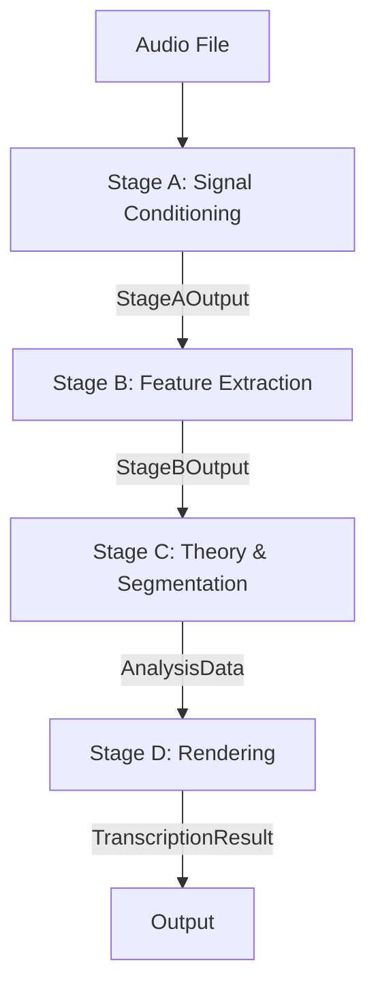

# Pipeline Workflow & Contracts

This document outlines the "happy path" call graph, data flow, and fallback strategies for the music transcription pipeline (Stages A-D).

## High-Level Data Flow



## Stage Contracts

Each stage must satisfy invariants at its output boundary. These are enforced by `backend.pipeline.validation.validate_invariants`.

### Stage A -> Stage B (Signal + Meta)
*   **Meta Consistency**: `meta.sample_rate`, `meta.hop_length`, `meta.window_size` are set and consistent.
*   **Signal**: `stems["mix"]` exists; length matches `meta.duration_sec` (approx).
*   **BPM**:
    *   If `beats` exist, they must be in seconds, strictly increasing, and within duration.
    *   If `tempo_bpm` is default (120) and `beats` are empty, it implies no detection occurred (valid fallback).

### Stage B -> Stage C (Pitch & Features)
*   **Timeline**: `StageBOutput.timeline` exists; `FramePitch.time` is monotonic.
*   **Polyphony**: If mode is polyphonic, `active_pitches` or `f0_layers` should be populated.
*   **Diagnostics**: Must contain keys explaining execution (e.g., `detectors_run`, `iss_layers_found`).

### Stage C -> Stage D (Notes)
*   **Ordering**: Notes sorted by time; `end_sec > start_sec`.
*   **Voices**: `voice` IDs are stable integers.
*   **Velocity**: Normalized to `[0..1]`.
*   **Polyphony**: In polyphonic mode, multiple unique `voice` IDs should appear if overlapping notes exist.

## Detailed Workflow & Fallbacks

### Stage A: `load_and_preprocess`
**Goal**: Normalize audio, estimate noise floor, detect global BPM.

1.  **Load Audio**: `librosa` / `soundfile`.
2.  **Preprocess**:
    *   DC Offset Removal.
    *   High-Pass Filter (default ~60Hz).
    *   Normalization (LUFS or RMS).
3.  **BPM Detection** (Optional):
    *   *Primary*: `librosa.beat.beat_track`.
    *   *Fallback*: Skip if audio < 6s or `librosa` missing -> `bpm=120`, `beats=[]`.
    *   *Log*: `stage_a.bpm_detection_skipped_...` or `stage_a.bpm_detection_success`.

### Stage B: `extract_features`
**Goal**: Extract F0 contours, confidence, and spectral features.

1.  **Instrument Profile**: Apply overrides (e.g., specific bandpass for guitar) if enabled.
2.  **Source Separation** (Optional): `demucs`.
    *   *Fallback*: If missing/fails, process "mix" only.
3.  **Detectors**: Run configured detectors (YIN, CREPE, etc.).
    *   *Fallback*: If all fail, return silence/empty timeline.
    *   *Log*: `stage_b.detector_init_failed`, `stage_b.no_detectors_fallback`.
4.  **Ensemble**: Merge detector outputs into `f0_main` / `confidence`.
5.  **Polyphonic Peeling** (Optional): Iterative Spectral Subtraction (ISS).

### Stage C: `apply_theory`
**Goal**: Convert frame-wise features into discrete Note Events.

1.  **Segmentation**: HMM (Viterbi) or Threshold-based.
    *   *Fallback*: If HMM fails (e.g., infinite cost), fall back to Threshold.
2.  **Theory**: Snap to key (optional), apply velocity curves.
3.  **Cleaning**: Remove micro-notes (glitch tolerance), merge fragmented notes.

### Stage D: `quantize_and_render`
**Goal**: Align notes to a musical grid and export XML/MIDI.

1.  **Quantization**:
    *   If `beats` exist (from Stage A), align to beat grid.
    *   *Fallback*: Use constant BPM (120) if no beats.
2.  **Voice Assignment**: Split notes into staff voices (Treble/Bass, Voice 1/2).
3.  **Export**: Generate MusicXML and MIDI bytes.

## Diagnostics Schema

Every stage populates a `diagnostics` dictionary:

```json
{
  "stage_a": {
    "bpm_method": "librosa",
    "bpm_fallback_reason": null
  },
  "stage_b": {
    "detectors_run": ["yin", "crepe"],
    "separation_enabled": false
  },
  "contracts": {
    "stage_a_b": "pass",
    "stage_b_c": "pass"
  }
}
```
