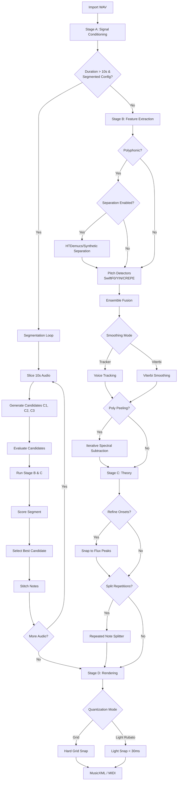

# Pipeline Workflow & Contracts

This document outlines the detailed call graph, data flow, algorithms, and configuration triggers for the music transcription pipeline (Stages A-D).

## Algorithm Selection & Flow

The following flowchart illustrates how the pipeline selects methods based on input characteristics and configuration, including the segmented transcription logic.



## Tunable Parameters (Tuner/Audit)

The following parameters are exposed for iterative tuning and audit verification.

### Stage A: Conditioning
*   `target_sample_rate`: Working sample rate (default 44100Hz, or 22050Hz for piano).
*   `loudness_normalization.target_lufs`: Target integrated loudness (e.g., -23.0).
*   `high_pass_filter.cutoff_hz`: HPF cutoff (20-60Hz).
*   `bpm_detection.min_bpm` / `max_bpm`: Allowed tempo range.

### Stage B: Features
*   **Separation**:
    *   `separation.enabled`: Auto/True/False.
    *   `separation.model`: "htdemucs" or "synthetic" (L2).
    *   `separation.harmonic_masking.mask_width`: Width of harmonic exclusion.
*   **Detectors**:
    *   `detectors.<name>.enabled`: Toggle SwiftF0, YIN, CREPE, RMVPE.
    *   `detectors.<name>.fmin/fmax`: Frequency search range.
    *   `ensemble_weights.<name>`: Contribution of each detector.
*   **Fusion & Smoothing**:
    *   `ensemble_mode`: "static" (weighted average) or "adaptive" (reliability-gated weighted median).
    *   `smoothing_method`: "tracker" (Hungarian) or "viterbi" (HMM).
    *   `voice_tracking.smoothing`: Temporal smoothing factor.
*   **Polyphony**:
    *   `polyphonic_peeling.max_layers`: Max voices to extract (ISS).
    *   `polyphonic_peeling.mask_width`: Spectral mask width.
    *   `polyphonic_peeling.iss_adaptive`: Enable adaptive strength.
    *   `polyphonic_peeling.use_freq_aware_masks`: Wider masks for bass frequencies.

### Stage C: Segmentation
*   **Logic**:
    *   `segmentation_method.method`: "hmm", "threshold", "viterbi".
    *   `confidence_threshold`: Minimum confidence for note activation.
    *   `min_note_duration_ms`: Minimum duration (Mono).
    *   `min_note_duration_ms_poly`: Minimum duration (Poly).
    *   `polyphonic_confidence`: Thresholds for Melody vs Accompaniment.
*   **Refinement**:
    *   `use_onset_refinement`: Snap start times to flux peaks.
    *   `use_repeated_note_splitter`: Split long notes on energy re-articulation.
    *   `pitch_tolerance_cents`: Max drift within a note.

### Stage D: Quantization
*   `quantization_mode`: "grid" or "light_rubato".
*   `light_rubato_snap_ms`: Window for snapping in rubato mode (e.g., 30ms).
*   `quantization_grid`: Grid resolution (16 = 1/16th).

---

## Stage A: Load & Preprocess (`backend/pipeline/stage_a.py`)

**Goal:** Normalize audio into a consistent, analysis-ready format (Mono, Fixed Sample Rate, Normalized Gain) and perform initial global analysis (BPM, Texture).

### Strategies & Algorithms

1.  **Loading & Resampling**:
    *   **Algorithm**: `librosa.load` (with fallback to `scipy.io.wavfile`).
    *   **Why**: Detectors (especially Neural ones) require fixed sample rates.
2.  **Mono Conversion**:
    *   **Algorithm**: Average channels `(L+R)/2` or select specific channel.
    *   **Why**: Pitch detection is inherently monophonic in the time domain.
3.  **DC Offset Removal**:
    *   **Algorithm**: `y = y - mean(y)`.
    *   **Why**: Removes 0Hz energy that biases RMS calculations.
4.  **High-Pass Filter (HPF)**:
    *   **Algorithm**: Butterworth filter (default order 4, ~55-60Hz).
    *   **Why**: Removes sub-bass rumble and mic handling noise.
5.  **Peak Limiting (Optional)**:
    *   **Algorithm**: Tanh soft-clipping or hard clipping.
    *   **Why**: Tames transients to prevent clipping during normalization.
6.  **Loudness Normalization**:
    *   **Algorithm**: EBU R128 (via `pyloudnorm`) or RMS-based gain.
    *   **Why**: Ensures consistent energy levels for detector confidence thresholds.
7.  **BPM Detection**:
    *   **Algorithm**: `librosa.beat.beat_track` (tightness=100).
    *   **Why**: Provides the rhythmic grid for quantization.
8.  **Texture Detection**:
    *   **Algorithm**: Spectral flatness analysis (`detect_audio_type`).
    *   **Why**: Sets `AudioType` (Mono/Poly) to guide Stage B/C algorithm selection.

### Output Contract: `StageAOutput`

```python
@dataclass
class StageAOutput:
    stems: Dict[str, Stem]      # "mix" stem always present
    meta: MetaData              # SR, Duration, BPM, Key, AudioType
    audio_type: AudioType       # MONOPHONIC | POLYPHONIC | POLYPHONIC_DOMINANT
    noise_floor_rms: float      # Estimated noise floor
    beats: List[float]          # Detected beat timestamps (seconds)
    diagnostics: Dict[str, Any] # "bpm_method", "preprocessing_applied", etc.
```

---

## Stage B: Feature Extraction (`backend/pipeline/stage_b.py`)

**Goal:** Extract fundamental frequency (f0) contours, confidence scores, and perform source separation if necessary.

### Strategies & Algorithms

1.  **Instrument Profile Resolution**:
    *   **Strategy**: Resolves `InstrumentProfile` (e.g., "piano_61key") to override detector params.
2.  **Source Separation (Optional)**:
    *   **Trigger**: `config.stage_b.separation.enabled` (True/Auto) AND Polyphonic.
    *   **Algorithm**: `HTDemucs` (Hybrid Transformer Demucs) or `SyntheticMDX`.
    *   **Why**: Isolates instruments (Vocals, Bass, Drums) for dense mixes.
3.  **Adaptive Fusion (Ensemble)**:
    *   **Trigger**: `ensemble_mode="adaptive"`.
    *   **Algorithm**: Weighted median of candidates, gated by signal stability and detector reliability.
    *   **Why**: Robust against single-detector errors; median is more stable than mean for outliers.
4.  **Viterbi Smoothing**:
    *   **Trigger**: `smoothing_method="viterbi"`.
    *   **Algorithm**: HMM-based pathfinding on the pitch curve to minimize octave jumps.
    *   **Why**: Produces smoother, more musical pitch contours than simple frame-by-frame selection.
5.  **Polyphonic Peeling (ISS)**:
    *   **Trigger**: `polyphonic_peeling.max_layers > 0` AND Polyphonic context.
    *   **Algorithm**: Iterative Spectral Subtraction with **Frequency-Aware Masking** (wider masks for bass).
    *   **Why**: Recovers secondary voices (accompaniment) hidden by the melody.

### Configuration & Thresholds

| Parameter | Default | Range | Description |
| :--- | :--- | :--- | :--- |
| `confidence_voicing_threshold` | 0.58 | 0.3-0.9 | Minimum confidence for voicing. |
| `ensemble_mode` | "static" | "static","adaptive" | Fusion strategy. |
| `smoothing_method` | "tracker" | "tracker","viterbi" | Smoothing algorithm. |
| `polyphonic_peeling.max_layers` | 8 | 0-16 | Max number of ISS layers. |
| `polyphonic_peeling.use_freq_aware_masks` | True | Bool | Wider masks for bass freqs. |

### Output Contract: `StageBOutput`

```python
@dataclass
class StageBOutput:
    time_grid: np.ndarray           # Time values for frames
    f0_main: np.ndarray             # Dominant pitch track (Hz)
    f0_layers: List[np.ndarray]     # Secondary pitch tracks (polyphony)
    stem_timelines: Dict[str, List[FramePitch]] # Per-stem timelines
    per_detector: Dict[str, Any]    # Raw detector outputs
    meta: MetaData                  # Passed through
    diagnostics: Dict[str, Any]     # "fused_f0", "smoothed_f0" curves
```

---

## Stage C: Theory & Segmentation (`backend/pipeline/stage_c.py`)

**Goal:** Convert continuous frame data into discrete musical `NoteEvents` (Start, End, Pitch, Velocity).

### Strategies & Algorithms

1.  **Skyline Selection**:
    *   **Trigger**: `polyphony_filter.mode = "skyline_top_voice"`.
    *   **Algorithm**: Selects "best" candidate per frame based on Confidence, Continuity, and Vocal Range.
2.  **Onset Refinement (`snap_onset`)**:
    *   **Trigger**: `use_onset_refinement=True`.
    *   **Algorithm**: Aligns note start times to local peaks in spectral flux (onset strength).
    *   **Why**: Improves timing accuracy for percussive or distinct attacks.
3.  **Repeated Note Splitter**:
    *   **Trigger**: `use_repeated_note_splitter=True`.
    *   **Algorithm**: Detects re-articulations (energy bumps) within sustained pitch segments to split them.
    *   **Why**: Handles repeated notes (e.g., piano) that pitch detectors see as a continuous line.
4.  **Polyphonic Decomposition**:
    *   **Trigger**: Polyphonic AudioType + `polyphony_filter.mode != "skyline_top_voice"`.
    *   **Algorithm**: Greedily assigns concurrent pitches to stable voice tracks.

### Configuration & Thresholds

| Parameter | Default | Range | Description |
| :--- | :--- | :--- | :--- |
| `use_onset_refinement` | True | Bool | Snap to flux peaks. |
| `use_repeated_note_splitter` | True | Bool | Split re-articulations. |
| `min_note_duration_ms` | 30.0 | 10-100 | Min duration (Mono). |
| `min_note_duration_ms_poly` | 45.0 | 30-150 | Min duration (Poly). |
| `confidence_threshold` | 0.20 | 0.1-0.9 | Base activation threshold. |

### Output Contract: `AnalysisData`

```python
@dataclass
class AnalysisData:
    meta: MetaData
    notes: List[NoteEvent]          # The final list of notes
    stem_timelines: Dict[str, List[FramePitch]]
    beats: List[float]              # Beat grid
    diagnostics: Dict[str, Any]     # "segmentation_method", "note_count"
```

---

## Stage D: Rendering (`backend/pipeline/stage_d.py`)

**Goal:** Align notes to the musical grid (Quantization) and export standard formats (MusicXML, MIDI).

### Strategies & Algorithms

1.  **Quantization**:
    *   **Mode: Grid**: Snaps all notes to nearest grid (e.g., 1/16th).
    *   **Mode: Light Rubato**: Only snaps notes that are within `light_rubato_snap_ms` (e.g., 30ms) of a grid line.
    *   **Why**: "Light Rubato" preserves expressive timing for solo performances while fixing obvious errors.
2.  **Voice Assignment**:
    *   **Strategy**: Uses `NoteEvent.voice` ID. Groups events by (Staff, Voice).
    *   **Mapping**: Treble/Bass Staff split (default C4/60).
3.  **Music21 Rendering**:
    *   **Objects**: `Note`, `Chord`, `Part`, `Score`.
    *   **Layout**: Grand Staff group.
4.  **Export**:
    *   **MusicXML**: String dump.
    *   **MIDI**: Binary write.

### Configuration & Thresholds

| Parameter | Default | Range | Description |
| :--- | :--- | :--- | :--- |
| `quantization_mode` | "grid" | "grid","light_rubato" | Quantization strategy. |
| `light_rubato_snap_ms` | 30.0 | 10-100 | Snap window for rubato. |
| `quantization_grid` | 16 | 4,8,16,32 | Grid resolution. |
| `staccato_marking.threshold_beats` | 0.25 | 0.1-1.0 | Max duration for staccato. |

### Output Contract: `TranscriptionResult`

```python
@dataclass
class TranscriptionResult:
    musicxml: str           # Full MusicXML content
    midi_bytes: bytes       # Standard MIDI file content
    analysis_data: AnalysisData # Ref to source data
```
